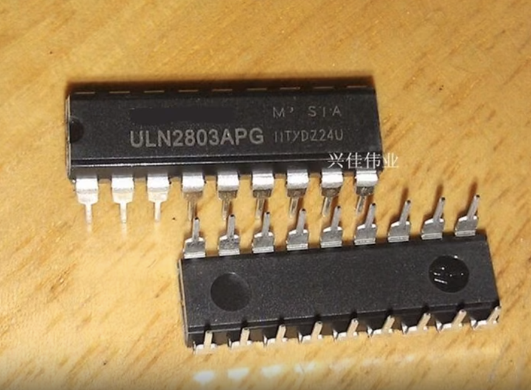
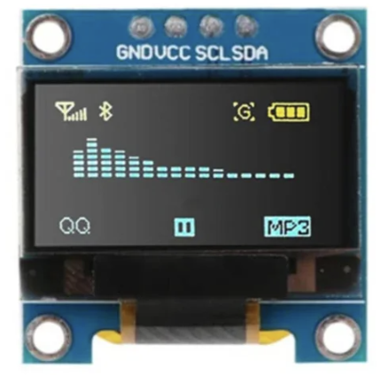
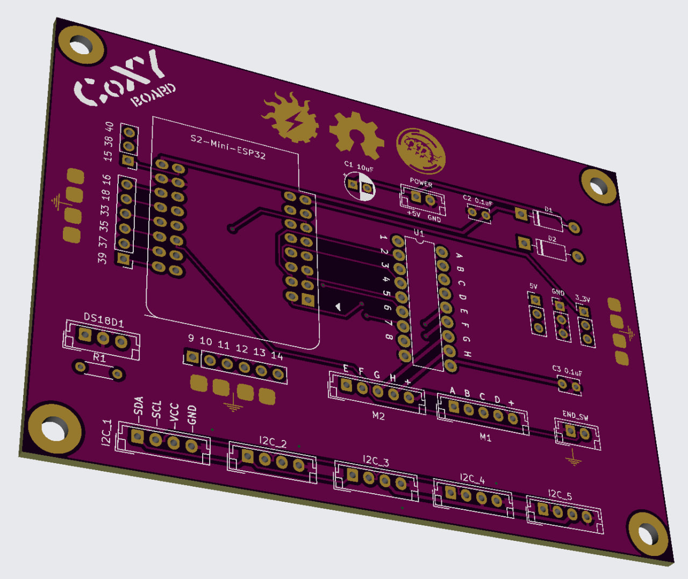
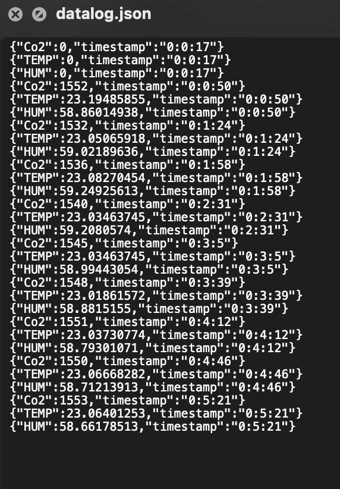
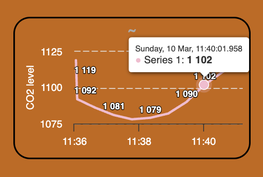

<!-- ## SOLARPUNKLAB - CoXY -->

<!-- PROJECT LOGO -->

 

<!-- TABLE OF CONTENTS -->

  
<b>CONTENTS</b>

  <ul>
	<li><a href="#about">About CoXY  </a></li>
	<li><a href="#coxy-hardware">CoXY Hardware  </a></li>
	<li><a href="#coxy-software">CoXY Sofwtare  </a></li>
  </ul>
  

  
   

<!-- >>>>>> TABLE ABOUT CoXY <<<<< -->
<table width = 90%>
<tr>
<td align = "justify" width = 90% colspan=2>

<b>ABOUT CoXY</b>
  
CoXY is a project by TeZ of 
<a href="http://solarpunklab.org">SOLARPUNK LAB</a> / 
<a href="http://hackteria.org">HACKTERIA</a> 
aimed at designing and experimenting a combined hardware and software platform that can function as a test bed for sensors' data monitoring/visualization and automation control, including motors, lights, switches and/or anything that can be driven by transistors. 
  

  
The concept arose from the collaborative efforts of Marc Dusseiller Dusjagr  and Fernando Castro, both affiliated with HACKTERIA. Their inspiration stemmed from their involvement in the GOSH Open Hardware project, where they jointly explored the design and creation of a DIY platform for Soil Respiration Chamber(SRC). See <a href="https://hackteria.org/wiki/CO2_Soil_Respiration_Chamber">Hackteria Wiki</a> for an extended overview and documentation.
  

  
TeZ and Marc reconstructed a SRC prototype at Solarpunk Lab headquarters in Amsterdam. Subsequently, TeZ embarked on experimenting with an expanded version, aiming to incorporate local sensor data monitoring via WiFi/websockets technology and mechanical parts control using motors. 
  

 

  
TeZ designed a printed circuit board (PCB) capable of seamlessly daisy-chaining up to five I2C devices. Additionally, it enables control over 8 channels of analog electrical signals via a transistor array IC. This is ideal to easily control the 2 coils of a 28byj-48 stepper motor with 4 channels. The PCB also features breakout options for additional ESP32 I/O pins and voltage supply.
  
</a>
This first version of the PCB is paired with a browser-based (hence cross-platform) software application, highly customizable and flexible.

  

  

 
</tr>
</table>

 
 <!-- >>>>>> TABLE CoXY HARDWARE <<<<< -->
<table width = 90%>
<tr>
<td align = "justify" width = 90% colspan=2>

<b>CoXY HARDWARE</b>
  
</a>
 
first working proto board

CoXY's test bed consists of a Lolin S2 mini ESP32 board expander that can directly interface to a ULN2803 darlington trasistor array and to the I2C bus with five onboard channels. More S2 i/o pins are exposed to connect other analog or one-wire sensors and actuators.
  
While the CoXY board was designed to reproduce a setup for Soil Respiration Chamber(s), this circuit can facilitate all kind of projects that make use of up to five I2C peripherals and up to 8 low power transistor controlled devices. The adoption of Lolin S2 Mini ESP32 board is very advantageous for the minimal size of this microcontroller, its power, the many number of i/o pins and the very convenient price too.
  

  
</tr>

<tr>

<td align = "left" width = 90% colspan=2>
<b>PARTS</b>
  
The test bed of choice for CoXY comprises:

<ul>
<li> Lolin S2 mini ESP32
<li> ULN2803 transistor array IC
<li> 28BYJ-48 stepper motor
<li> SENSIRION SCD41 - I2C Carbon Dioxide, temperature and humidity sensor
<li> BME680 - I2C temperature, humidity, pressure and gas sensor
<li> DALLAS DS18b20 "one-wire" Temperature sensor
<li> SSD1306 - 128x64 - I2C OLED display
</ul>

All parts are "optional" and can be excluded from the setup by simply commenting the #define statements in the main.cpp code. 
  
The <a href="https://github.com/GenericLab/UROS-CO2_brkout">UROS breakout</a> board was kindly provided by Marc to support the development of this project and it features also an optional connection to a NEOPIXEL rgb led unit.
  
Below all images and links to source the individual parts.
  
<nr>
LOLIN S2 Mini ESP32
  
<a href="https://nl.aliexpress.com/item/32461441516.html"> 
ULN2803  - Bipolar (BJT) Transistor Array 8 NPN Darlington 50V 500mA </a>
  
<a href="https://nl.aliexpress.com/item/1005006141716201.html"> 
28BYJ-48 5V stepper motor</a>
  
<a href="https://nl.aliexpress.com/item/1005006387743045.html"> 
SCD41  I2C Carbon Dioxide, Temperature And Humidity sensor</a>
  
<a href="https://github.com/GenericLab/UROS-CO2_brkout"> 
SCD41 UROS breakout</a>
  
<a href="https://nl.aliexpress.com/item/1005001602441073.html"> 
BME680 Digital Temperature, Humidity, Pressure, Gas Sensor </a>
  

<a href="https://nl.aliexpress.com/item/32676135779.html"> 
DALLAS DS18b20 "one-wire" Temperature sensor</a>
  

<a href="https://nl.aliexpress.com/item/1005006141235306.html"> 
SSD1306 - 128x64 - I2C OLED display</a>
  

CoXY BOARD is a PCB designed by TeZ and currently in testing phase. More details and photos will be published soon.

 

  

  

 

</td>
 
</tr>
</table>

<!-- >>>>>> TABLE CoXY SOFTWARE<<<<< -->
<table width = 90%>
<tr>
<td align = "justify" width = 90% colspan=2>

<b>CoXY SOFTWARE</b>
  
The CoXY KONTROL software is a web app served by the ESP32 developed as a combined Arduino C++, HTML5, Javascript, CSS and JSON code base. This browser-based app can therefore run on any device.
  

 
CoXY KONTROL dashboard
  
In order to simultaneously work with different languages and many different Arduino and Javascript libraries, VS-CODE / Platform IO was chosen as development environment. This way all the code base can be easily copied, edited and transferred at once without the need of re-configuration.
  

 
VS-CODE environment
  
All files of this app are served (or created and stored in real-time) directly from the SPIFFS internal memory of the ESP32. That includes the main index.html page, the javascript code and libraries, css and json codes, images and fonts assets.
  

  
In this application the SPIFFS file occupy about 1/3 ot the total available memory. 
  

  
The esp32 sketch files "main.cpp" and "NETWORK.h" must be uploaded clicking on the arrow icon on the top right of VS-CODE window.
  

  
Once SPIFFS and sketch files are uploaded to the ESP32, and the board has connected to a local WiFi network (or it has created its own "COXY-NET" access point) we can point our browser to the URL http://coxy.local
  

  
By clicking on the S icon or hitting the 's' key the SPIFFS memory popup will open to show that status of the spiffs internal memory and the currently stored and served files.
  

  
A reading is taken every 30 seconds from all sensors at once with a timeout callback.
A progress bar shows the countdown at each reading cycle.
  

  
Data visualization is done via javascript on span elements for all sensors, except the SCD41's Co2 level, Temperature and Humidity that are shown via <a href="https://github.com/highcharts/highcharts">highcharts javascript library</a> featuring interactive data display.
  

  
A data log file with all the readings for the SCD41 is progressively saved in datalog.json file in the SPIFFS until the remaining inernal memory reaches a safety limit of 20kb. The json file can be downloaded locally by clicking on the datalog button.
  

  

  

  

 
</tr>
</table>

